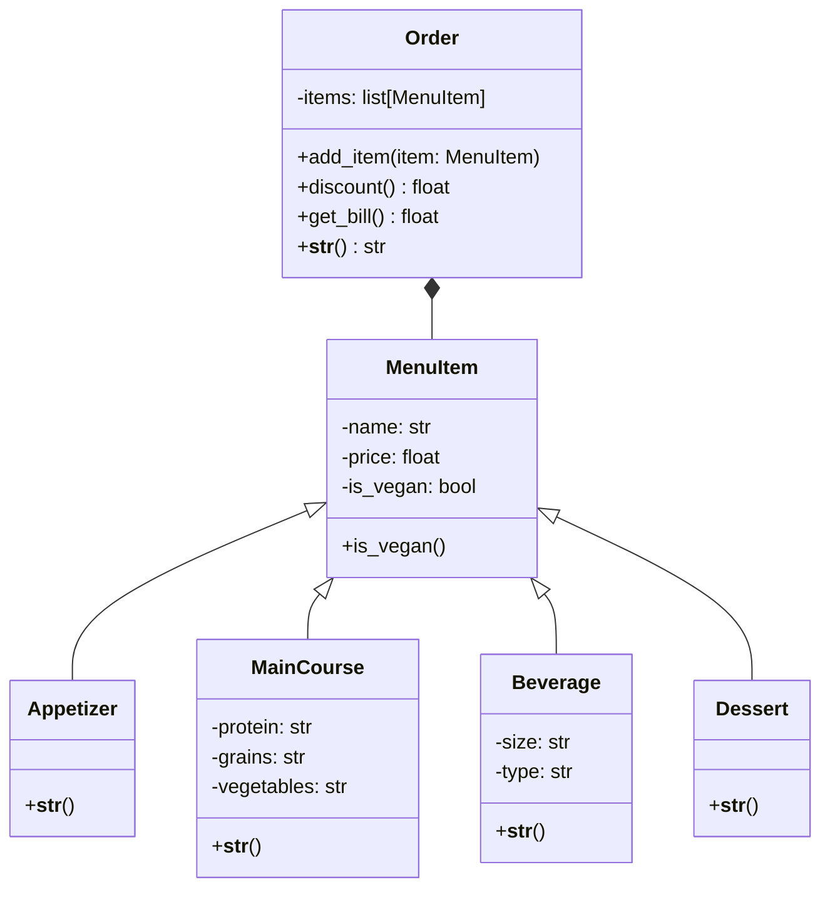

# RETO_3

Se desarrolló el ejercicio de clase y el escenario de restaurante, el diagrama de clases planteado para su desarrollo fue este:

```mermaid
classDiagram
    class MenuItem {
        -name: str
        -price: float
        -is_vegan: bool
        +is_vegan()
    }

    class Appetizer {
        +__str__()
    }

    class MainCourse {
        -protein: str
        -grains: str
        -vegetables: str
        +__str__()
    }

    class Beverage {
        -size: str
        -type: str
        +__str__()
    }

    class Dessert {
        +__str__()
    }

    class Order {
        -items: list[MenuItem]
        +add_item(item: MenuItem)
        +discount() float
        +get_bill() float
        +__str__() str
    }

    MenuItem <|-- Appetizer
    MenuItem <|-- MainCourse
    MenuItem <|-- Beverage
    MenuItem <|-- Dessert
    Order *-- MenuItem 
```
